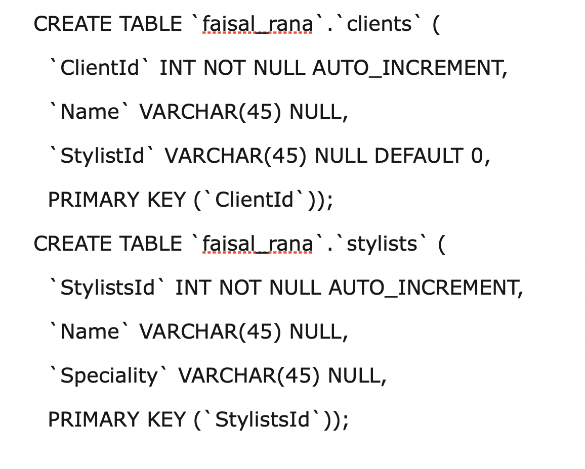
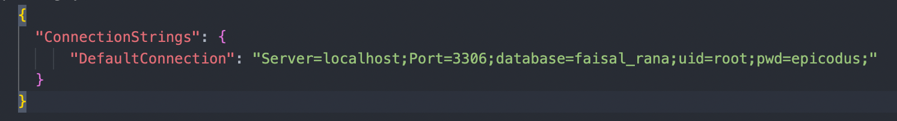
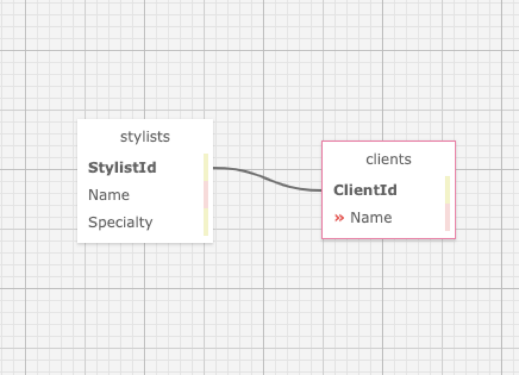

# Eau Claire's Salon

### Epicodus Independent Code Review - Database Basics

### By Faisal Rana

## Technologies Used

* C#
* Github
* .NET 5.0
* ASP.NET Core
* Entity Framework Core
* MVC
* Lazy Loading
* RESTful Routing, CRUD & HTTP
* MySQL MySQL Workbench
* Bootstrap
* Razor View Engine
## Description

This web application is built for a HairSalon to manage their employees and stylists.

## Setup/Installation Requirements

* _Requires Visual Studio Code Installation_
* _Requires Terminal Installation_
* _Open the terminal on your local machine_
* _Navigate to the directory inside of which you wish to house this project_
* _Clone this project with the following command  `$ git clone <https://github.com/FaisalRana/HairSalon>`_
* _Download and install .NET Core through this link if you don't already have it: https://dotnet.microsoft.com/download_
* _Return to your terminal and navigate to the root directory by entering `$ cd HairSalon`_
* _Open this project in Visual Studio Code with the command `$ code .`_
* _Still in the terminal, navigate to the desired subdirectory of the repository with the command `$ cd HairSalon`_
* _Retrieve and install packages listed in the .csproj files with the command `$ dotnet restore`_
* _Launch web application with command `$ dotnet run`_

**The following instructions are for re-creating the MySQL Database using `HairSalon\faisal_rana.sql`**
* Download and install mySQL workbench: https://dev.mysql.com/downloads/file/?id=484391
* In MySQL Workbench, navigate to the _Administration_ window and click _Data Import/Restore_
* In the _Data Import_ screen, select _Import from Self-Contained File_, click the 3 dots on the right, and navigate to _HairSalon.Solution\faisal_rana.sql_
* Under _Default Scheme to be Import To_ select the _New_ button
  * Enter a name for your database 
  * Click _Ok_
* Click _Start Import_
* In the _Navigator_ > _Schemas_ tab, right click and select _Refresh All_. The new database will appear.
* Alternatively, you can use access mysql through the terminal and using the following commands:

* _In Visual Studio Code, navigate to the `HairSalon` directory and create an **appsettings.json** file and input the following script 

* _Back in the terminal, navigate to `$ cd HairSalon ` and run the application with the command `$ dotnet run`

## Diagram of the One-To-Many relationship used in this project

## Known Bugs

No k  nown bugs

## License

Copyright (c) 2021 Faisal Rana

This software is licensed under the MIT license

## Contact Information

inquisitive@@gmail.

